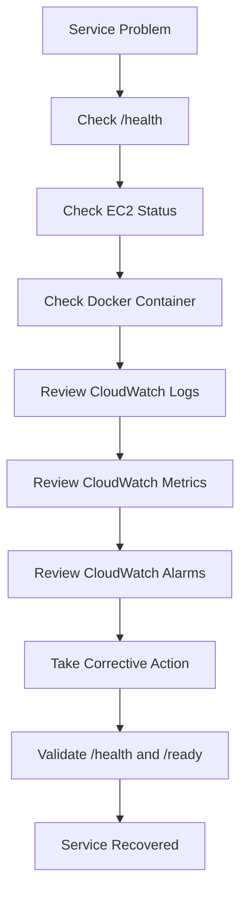

# OpsPulse

## AWS Cloud Operations & Monitoring Platform

OpsPulse is a production-style cloud operations and DevOps project designed to demonstrate the deployment, monitoring, alerting, troubleshooting, and recovery of a containerised application running on AWS.

The project combines **FastAPI, Docker, AWS EC2, Terraform, IAM, Amazon CloudWatch, Amazon SNS, Git, and GitHub** to demonstrate the complete operational lifecycle of a cloud-hosted application.

**Build → Containerise → Provision → Deploy → Monitor → Alert → Troubleshoot → Recover**

---

# Table of Contents

- [Project Overview](#project-overview)
- [Solution Architecture](#solution-architecture)
- [Architecture Components](#architecture-components)
- [Core Features](#core-features)
- [Technology Stack](#technology-stack)
- [Application Endpoints](#application-endpoints)
- [Containerisation](#containerisation)
- [AWS Infrastructure](#aws-infrastructure)
- [Infrastructure as Code](#infrastructure-as-code)
- [Security](#security)
- [Centralised Logging](#centralised-logging)
- [Monitoring](#monitoring)
- [SNS Alerting](#sns-alerting)
- [Alert Validation](#alert-validation)
- [Incident Response](#incident-response)
- [Troubleshooting Experience](#troubleshooting-experience)
- [Repository Structure](#repository-structure)
- [Operational Workflow](#operational-workflow)
- [Skills Demonstrated](#skills-demonstrated)
- [Project Status](#project-status)
- [Learning Outcomes](#learning-outcomes)
- [Future Improvements](#future-improvements)
- [Author](#author)

---

# Project Overview

OpsPulse runs a lightweight FastAPI application inside a Docker container hosted on an Amazon EC2 instance.

AWS infrastructure is provisioned and managed using Terraform.

The application provides dedicated health and readiness endpoints, while Amazon CloudWatch provides:

- Centralised application logging
- Infrastructure metrics
- Operational dashboards
- Alarm management

Amazon SNS is integrated with CloudWatch to provide automated email notifications when infrastructure enters an alarm state.

OpsPulse demonstrates practical skills relevant to roles such as:

- Cloud Operations Engineer
- Cloud Support Engineer
- DevOps Engineer
- Technical Operations Engineer
- Platform Support Engineer
- Infrastructure Engineer

---

# Solution Architecture

```mermaid
flowchart TD

    DEV[Developer / GitHub Repository]

    DEV --> TF[Terraform Infrastructure as Code]

    TF --> AWS[AWS Cloud Environment]

    AWS --> SG[Security Group]
    AWS --> IAM[IAM Role and Instance Profile]
    AWS --> EC2[Amazon EC2]
    AWS --> CW[Amazon CloudWatch]
    AWS --> SNS[Amazon SNS]

    SG --> EC2
    IAM --> EC2

    EC2 --> DOCKER[Docker Engine]
    DOCKER --> API[OpsPulse FastAPI Application]

    API --> HEALTH[/health]
    API --> READY[/ready]
    API --> DOCS[/docs]

    DOCKER --> LOGS[Application Logs]

    LOGS --> CWLOGS[CloudWatch Logs]
    EC2 --> METRICS[EC2 Metrics]

    CWLOGS --> CW
    METRICS --> CW

    CW --> DASH[CloudWatch Dashboard]
    CW --> ALARM[High CPU Alarm]

    ALARM --> SNS
    SNS --> EMAIL[Email Notification]

    EMAIL --> OPS[Operations Engineer]

    OPS --> INVESTIGATE[Incident Investigation]
    INVESTIGATE --> HEALTH
    INVESTIGATE --> CWLOGS
    INVESTIGATE --> DASH
```

---

# Architecture Components

## GitHub

GitHub acts as the central source-control repository for:

- Application code
- Docker configuration
- Terraform infrastructure
- Incident-response documentation
- Project documentation

Git is used to track and manage changes throughout the project.

---

## Terraform

Terraform provides the Infrastructure as Code layer.

Terraform manages resources including:

- EC2 instance
- Security group
- IAM role
- IAM instance profile
- CloudWatch log group
- CloudWatch alarm
- CloudWatch dashboard
- SNS topic
- SNS email subscription

This makes the infrastructure reproducible and version-controlled.

---

## Amazon EC2

Amazon EC2 provides the compute environment for OpsPulse.

The deployment follows:

```text
Amazon EC2
     │
     ▼
Docker Engine
     │
     ▼
OpsPulse Container
     │
     ▼
FastAPI Application
```

The FastAPI application listens on:

```text
TCP Port 8000
```

---

## Docker

Docker packages the FastAPI application and its dependencies into a portable container.

Docker provides:

- Consistent application runtime
- Dependency isolation
- Simplified deployment
- Container restart capability
- CloudWatch logging integration

---

## FastAPI

FastAPI provides the application layer.

The application exposes:

```text
/
```

```text
/health
```

```text
/ready
```

```text
/docs
```

These endpoints provide both application functionality and operational visibility.

---

## IAM

The EC2 instance uses an IAM role and instance profile to interact with AWS services.

This avoids storing permanent AWS credentials directly on the EC2 server.

IAM permissions support services such as CloudWatch logging and monitoring.

---

## Security Groups

AWS security groups control access to the EC2 instance.

SSH access is restricted to an authorised public IP address rather than being exposed to the entire internet.

Application traffic is allowed through:

```text
TCP Port 8000
```

---

## Amazon CloudWatch

CloudWatch provides:

- EC2 metrics
- Application logs
- Dashboard visibility
- CPU monitoring
- Alarm management

---

## Amazon SNS

Amazon SNS provides the notification layer.

When the CloudWatch CPU alarm enters the `ALARM` state, an event is published to SNS.

SNS then sends an email notification to the configured subscriber.

Recovery notifications are also enabled when the alarm returns to `OK`.

---

# Core Features

OpsPulse includes:

- FastAPI application
- Docker containerisation
- AWS EC2 hosting
- Terraform Infrastructure as Code
- IAM-based permissions
- Restricted SSH access
- Health checks
- Readiness checks
- Centralised CloudWatch logging
- CloudWatch infrastructure metrics
- CloudWatch dashboard
- High-CPU monitoring
- SNS email alerting
- Alarm recovery notifications
- Incident-response documentation
- Git version control
- Infrastructure recovery testing

---

# Technology Stack

| Technology | Purpose |
|---|---|
| Python | Application development |
| FastAPI | REST API framework |
| Uvicorn | ASGI application server |
| Docker | Containerisation |
| AWS EC2 | Cloud compute |
| Terraform | Infrastructure as Code |
| AWS IAM | Access management |
| Security Groups | Network security |
| Amazon CloudWatch | Logs, metrics, dashboards and alarms |
| Amazon SNS | Email notifications |
| AWS CLI | AWS administration and testing |
| Git | Version control |
| GitHub | Source-code repository |

---

# Application Endpoints

## Root Endpoint

```text
/
```

Confirms that the OpsPulse API is accessible.

---

## Health Endpoint

```text
/health
```

Used to confirm that the application is alive.

Example response:

```json
{
  "status": "healthy",
  "environment": "production"
}
```

---

## Readiness Endpoint

```text
/ready
```

Used to confirm that the application is ready to receive traffic.

Readiness endpoints are useful for monitoring tools, container platforms, and load balancers.

---

## API Documentation

```text
/docs
```

FastAPI automatically provides interactive Swagger/OpenAPI documentation.

---

# Containerisation

The application is packaged into a Docker image.

Build:

```bash
docker build -t opspulse .
```

The production container uses:

```bash
docker run -d \
  --name opspulse \
  --restart unless-stopped \
  -p 8000:8000 \
  -e APP_ENV=production \
  --log-driver=awslogs \
  --log-opt awslogs-region=eu-west-2 \
  --log-opt awslogs-group=/opspulse/application \
  --log-opt awslogs-stream=opspulse-production \
  opspulse
```

The restart policy:

```text
--restart unless-stopped
```

allows Docker to restart the application following unexpected interruption.

---

# AWS Infrastructure

OpsPulse is deployed in:

```text
AWS Region: eu-west-2
```

The cloud environment includes:

- EC2
- Security Groups
- IAM
- CloudWatch
- SNS

The EC2 instance hosts the Docker runtime and FastAPI application.

---

# Infrastructure as Code

Terraform manages the AWS infrastructure.

The workflow used is:

```bash
terraform init
terraform fmt
terraform validate
terraform plan
terraform apply
```

Before deployment, `terraform plan` is reviewed to identify resources that Terraform intends to:

```text
Create
Change
Replace
Destroy
```

Using Infrastructure as Code provides:

- Repeatability
- Version control
- Consistency
- Change tracking
- Faster recovery
- Reduced configuration drift

---

# Security

## SSH Access

SSH access is restricted to an authorised public IP address.

This prevents unrestricted SSH access from the internet.

---

## IAM Permissions

The EC2 instance uses an IAM role and instance profile.

This allows AWS service access without storing permanent AWS credentials directly on the server.

---

## Network Access

Application traffic is exposed through:

```text
TCP Port 8000
```

using the configured EC2 security group.

---

# Centralised Logging

Docker application logs are forwarded to Amazon CloudWatch Logs.

## Log Group

```text
/opspulse/application
```

## Log Stream

```text
opspulse-production
```

CloudWatch logs capture information including:

- FastAPI startup
- Uvicorn startup
- HTTP requests
- Health checks
- Readiness checks
- API documentation requests
- HTTP response status codes

Centralised logging allows application behaviour to be investigated without relying only on local EC2 logs.

---

# Monitoring

## CloudWatch Dashboard

A dedicated CloudWatch dashboard provides operational visibility into the environment.

The dashboard includes information such as:

- EC2 CPU utilisation
- Network activity
- Instance status
- Application activity
- Logs
- Alarm state

This provides a central operational view of the application and infrastructure.

---

## CPU Alarm

A CloudWatch alarm monitors EC2 CPU utilisation.

Alarm name:

```text
opspulse-high-cpu
```

Configuration:

| Setting | Value |
|---|---|
| Metric | CPUUtilization |
| Namespace | AWS/EC2 |
| Statistic | Average |
| Threshold | Greater than 70% |
| Period | 300 seconds |
| Evaluation Periods | 2 |

If CPU utilisation exceeds the configured threshold for the required evaluation periods, the alarm enters:

```text
ALARM
```

---

# SNS Alerting

The CloudWatch alarm is connected to the SNS topic:

```text
opspulse-alerts
```

The alert path is:

```text
EC2 CPU Metric
      │
      ▼
CloudWatch
      │
      ▼
CloudWatch Alarm
      │
      ▼
Amazon SNS
      │
      ▼
Email Notification
```

When the alarm changes from:

```text
OK → ALARM
```

SNS sends an email notification.

Recovery notifications are also configured for:

```text
ALARM → OK
```

This means the operator receives notification both when an incident begins and when the monitored resource recovers.

---

# Alert Validation

The monitoring and notification workflow was tested end-to-end.

The CloudWatch alarm was manually moved into the `ALARM` state using the AWS CLI:

```bash
aws cloudwatch set-alarm-state \
  --alarm-name opspulse-high-cpu \
  --state-value ALARM \
  --state-reason "Testing OpsPulse SNS email notification" \
  --region eu-west-2
```

The SNS email notification was successfully received.

The alarm was then returned to:

```text
OK
```

to validate recovery behaviour.

This confirmed the alerting path:

```text
CloudWatch Metric
       │
       ▼
CloudWatch Alarm
       │
       ▼
Amazon SNS
       │
       ▼
Email Notification
```

---

# Observability Model

OpsPulse demonstrates three core observability areas.

## Logs

```text
FastAPI
   │
   ▼
Docker
   │
   ▼
CloudWatch Logs
```

Logs help investigate application behaviour.

---

## Metrics

```text
Amazon EC2
     │
     ▼
CloudWatch Metrics
```

Metrics provide infrastructure performance information.

---

## Alerts

```text
CloudWatch Metric
       │
       ▼
CloudWatch Alarm
       │
       ▼
SNS
       │
       ▼
Email
```

Alerts notify the operator when abnormal infrastructure conditions occur.

---

# Incident Response

The project includes an incident-response runbook:

```text
docs/incident-runbook.md
```

A typical incident workflow is:



This provides a structured troubleshooting and recovery process.

---

# Troubleshooting Experience

The project involved resolving several realistic infrastructure and cloud issues.

These included:

- SSH authentication problems
- SSH key permissions
- Security-group configuration errors
- Incorrect public IP configuration
- Docker port conflicts
- Docker container recreation
- IAM permission errors
- CloudWatch integration problems
- Terraform configuration changes
- Terraform EC2 replacement
- EC2 public IP changes
- Application redeployment
- Git remote conflicts
- SNS subscription validation
- CloudWatch alarm testing

One of the most significant recovery scenarios occurred when Terraform replaced the EC2 instance.

The application had to be restored by:

1. Updating network access
2. Connecting to the replacement EC2 instance
3. Cloning the application repository
4. Rebuilding the Docker image
5. Starting the production container
6. Reconnecting CloudWatch logging
7. Testing `/health`
8. Testing `/ready`
9. Confirming CloudWatch logs
10. Revalidating monitoring and alerting

This demonstrated both infrastructure deployment and operational recovery skills.

---

# Repository Structure

```text
opspulse-cloud-operations/
│
├── app/
│   └── main.py
│
├── terraform/
│   └── main.tf
│
├── docs/
│   └── incident-runbook.md
│
├── Dockerfile
├── requirements.txt
├── .gitignore
└── README.md
```

---

# Operational Workflow

If OpsPulse becomes unavailable:

## 1. Test the Application

```bash
curl http://<EC2-PUBLIC-IP>:8000/health
```

---

## 2. Check EC2

Confirm the EC2 instance is running and passing status checks.

---

## 3. Check Docker

```bash
docker ps
```

---

## 4. Review Logs

Inspect:

```text
/opspulse/application
```

in CloudWatch Logs.

---

## 5. Review Metrics

Check:

- CPU utilisation
- Network activity
- Instance status

---

## 6. Review Alarm State

Check:

```text
opspulse-high-cpu
```

---

## 7. Take Corrective Action

Restart or redeploy the Docker container if necessary.

---

## 8. Validate Recovery

Confirm:

```text
/health
/ready
```

return successful responses.

---

# Skills Demonstrated

## AWS

- EC2
- IAM
- Security Groups
- CloudWatch
- SNS
- AWS CLI

## DevOps

- Docker
- Terraform
- Infrastructure as Code
- Git
- GitHub

## Monitoring

- CloudWatch Metrics
- CloudWatch Logs
- CloudWatch Dashboards
- CloudWatch Alarms
- SNS Alerting
- Health Checks
- Readiness Checks

## Operations

- Incident investigation
- Log analysis
- Infrastructure troubleshooting
- Service recovery
- Alert validation
- Infrastructure lifecycle management

---

# Project Status

**OpsPulse is complete and operationally validated.**

Implemented features:

- ✅ FastAPI application
- ✅ Health endpoint
- ✅ Readiness endpoint
- ✅ API documentation
- ✅ Docker containerisation
- ✅ AWS EC2 deployment
- ✅ Terraform Infrastructure as Code
- ✅ Security-group configuration
- ✅ Restricted SSH access
- ✅ IAM role and instance profile
- ✅ CloudWatch centralised logging
- ✅ CloudWatch CPU monitoring
- ✅ CloudWatch dashboard
- ✅ High-CPU alarm
- ✅ Amazon SNS integration
- ✅ Email alerts
- ✅ Recovery notifications
- ✅ Alert validation
- ✅ Incident-response runbook
- ✅ Infrastructure recovery testing
- ✅ GitHub version control
- ✅ Solution architecture documentation

---

# Learning Outcomes

OpsPulse provided practical experience across the complete lifecycle of a cloud-hosted application.

Key learning areas included:

- Deploying containerised workloads
- Managing AWS infrastructure
- Writing Terraform configuration
- Managing infrastructure changes
- Configuring IAM permissions
- Securing network access
- Centralising application logs
- Monitoring EC2 metrics
- Building CloudWatch dashboards
- Creating automated alerts
- Integrating SNS notifications
- Troubleshooting infrastructure failures
- Recovering applications after infrastructure changes
- Validating application health
- Managing projects through Git and GitHub

The project demonstrates that operating a cloud application involves more than simply deploying infrastructure.

It requires visibility, monitoring, alerting, troubleshooting, recovery, and operational documentation.

---

# Future Improvements

Possible future enhancements include:

- HTTPS
- Custom domain
- Application Load Balancer
- Auto Scaling
- CI/CD pipeline
- ECS deployment
- EKS deployment
- Kubernetes
- Additional CloudWatch alarms
- Memory monitoring
- Application latency monitoring
- Automated deployment
- Blue/green deployment
- Enhanced observability

These are optional future improvements rather than requirements for the current project.

---

# Project Summary

OpsPulse demonstrates an end-to-end cloud operations environment using:

**FastAPI + Docker + AWS EC2 + Terraform + CloudWatch + SNS**

Terraform manages the AWS infrastructure.

Docker runs the FastAPI application on EC2.

CloudWatch provides centralised logs, infrastructure metrics, dashboards, and alarms.

Amazon SNS provides automated email notifications when monitored infrastructure enters an alarm state.

Health and readiness endpoints provide application-level visibility.

An incident-response runbook provides a structured troubleshooting and recovery process.

The monitoring and alerting workflow has been successfully tested end-to-end.

---

# Author

**Amos Agboola**

Cloud / DevOps Portfolio Project

OpsPulse was built as a practical demonstration of cloud infrastructure deployment, Infrastructure as Code, containerisation, monitoring, alerting, troubleshooting, and operational recovery using AWS and modern DevOps tools.
